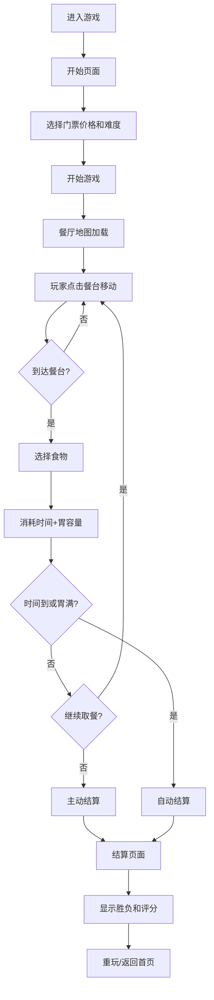

## 1. 产品概述

自助餐策略游戏——玩家在限时两小时的虚拟自助餐厅中规划取餐路线，在胃容量和时间的双重约束下最大化食物价值，吃回门票成本即获胜。

- 核心玩法：策略路径规划 + 资源管理（时间、胃容量）
- 目标用户：喜欢休闲策略游戏的玩家

## 2. 核心功能

### 2.1 功能模块

1. **开始页面**：游戏标题、门票价格设定、难度选择、开始按钮
2. **游戏主界面**：餐厅平面图、玩家角色、餐台分布、状态栏（时间/胃容量/已吃金额）
3. **结算页面**：最终得分、胜负判定、详细账单、重玩按钮

### 2.2 页面详情

| 页面名称 | 模块名称 | 功能描述 |
|-----------|-------------|---------------------|
| 开始页面 | 标题区域 | 游戏名称展示，带动画效果 |
| 开始页面 | 门票设定 | 选择门票价格（影响胜利条件） |
| 开始页面 | 难度选择 | 简单/普通/困难（影响时间流速、菜品数量） |
| 游戏页面 | 顶部状态栏 | 剩余时间倒计时、胃容量进度条、累计金额、门票价格 |
| 游戏页面 | 餐厅地图 | 网格化餐厅布局，显示各餐台位置和食物信息 |
| 游戏页面 | 玩家角色 | 显示当前位置，点击移动 |
| 游戏页面 | 取餐操作 | 到达餐台后弹出食物选择，选择后消耗时间和胃容量 |
| 游戏页面 | 食物库存 | 每道菜有限份数，被拿完会显示售罄 |
| 结算页面 | 胜负判定 | 根据消费金额是否>门票价判定胜负 |
| 结算页面 | 账单明细 | 列出所有取餐记录、单价、饱腹值 |
| 结算页面 | 评分系统 | 基础分+吃回本奖励-暴饮暴食扣分 |
| 结算页面 | 重玩按钮 | 返回开始页面重新游戏 |

## 3. 核心流程

## 4. 用户界面设计

### 4.1 设计风格

- **主色调**：暖橙色系（#FF6B35 主色，#FFB088 辅助色，#FFF4EC 背景色），营造美食餐厅的温馨氛围
- **强调色**：深绿色（#2D6A4F）代表"健康/回本"，深红色（#C1121F）代表"危险/暴食"
- **按钮风格**：圆润立体按钮，带微阴影和悬停放大效果
- **字体**：标题使用 "ZCOOL KuaiLe"（中文快乐体），正文使用 "Noto Sans SC"
- **布局风格**：卡片式布局，圆角设计，柔和阴影
- **图标风格**：Emoji 食物图标 🍣🦞🥩🍰🍜 搭配简约线条图标

### 4.2 页面设计概述

| 页面名称 | 模块名称 | UI 元素 |
|-----------|-------------|-------------|
| 开始页面 | 标题区域 | 大号艺术字标题，食物装饰元素，渐入动画 |
| 开始页面 | 门票卡片 | 拟物化门票设计，带撕痕效果，价格滑块 |
| 开始页面 | 难度选择 | 三个胶囊按钮，选中态高亮 |
| 游戏页面 | 顶部状态栏 | 时间胶囊（倒计时变红警告）、胃容量进度条（渐变填充）、金额累计卡片 |
| 游戏页面 | 餐厅地图 | 网格化布局，餐台用不同颜色区分品类，玩家角色高亮 |
| 游戏页面 | 取餐弹窗 | 食物卡片列表，显示价格/饱腹值/剩余份数，选择按钮 |
| 结算页面 | 胜负横幅 | 大号胜利/失败文字，彩带动画（胜利时） |
| 结算页面 | 账单列表 | 逐条食物记录，右侧金额和饱腹值，底部合计 |
| 结算页面 | 分数卡片 | 得分拆分展示，动画累加效果 |

### 4.3 响应式设计

- 桌面端优先设计，采用固定宽度游戏区域居中布局
- 平板端自适应缩放，保持游戏比例
- 移动端简化操作，餐台点击区域放大
