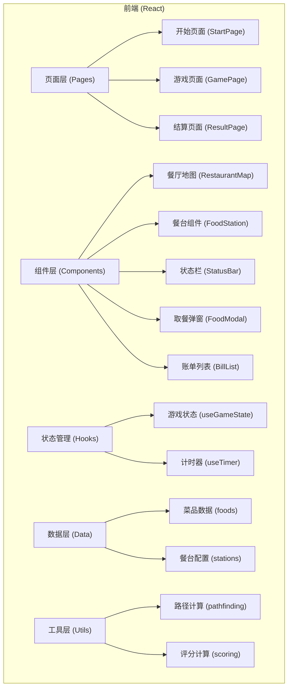

## 1. 架构设计



## 2. 技术描述

- **前端框架**: React@18 + TypeScript
- **构建工具**: Vite@5
- **样式方案**: TailwindCSS@3 + 自定义 CSS 动画
- **状态管理**: React useState + useReducer (轻量级场景，无需 Redux)
- **路由**: React Router@6
- **图标**: Emoji + Lucide React
- **字体**: Google Fonts (ZCOOL KuaiLe, Noto Sans SC)

## 3. 路由定义

| 路由 | 用途 |
|-------|---------|
| / | 开始页面（门票设定、难度选择） |
| /game | 游戏主界面（餐厅地图、取餐操作） |
| /result | 结算页面（评分、账单、重玩） |

## 4. 数据模型

### 4.1 核心类型定义

```typescript
// 食物品类
type FoodCategory = 'seafood' | 'meat' | 'staple' | 'dessert' | 'drink' | 'vegetable'

// 菜品
interface Food {
  id: string
  name: string
  emoji: string
  category: FoodCategory
  price: number       // 单价（元）
  satiety: number     // 饱腹值（0-100）
  stock: number       // 初始份数
  timeCost: number    // 取餐消耗时间（秒，游戏内）
}

// 餐台
interface Station {
  id: string
  name: string
  category: FoodCategory
  position: { x: number; y: number }  // 网格坐标
  foods: Food[]
}

// 难度
type Difficulty = 'easy' | 'normal' | 'hard'

// 取餐记录
interface EatenRecord {
  food: Food
  quantity: number
  timestamp: number
}

// 游戏状态
interface GameState {
  phase: 'start' | 'playing' | 'ended'
  ticketPrice: number
  difficulty: Difficulty
  timeRemaining: number     // 剩余时间（秒，游戏内两小时=120分钟）
  stomachCapacity: number   // 胃容量 0-100
  totalValue: number        // 已吃食物总价值
  currentPosition: { x: number; y: number }
  eatenRecords: EatenRecord[]
  stations: Station[]       // 含实时库存
}

// 游戏结果
interface GameResult {
  isWin: boolean
  totalScore: number
  breakdown: {
    baseScore: number
    valueBonus: number
    overeatPenalty: number
  }
  eatenRecords: EatenRecord[]
  totalValue: number
  ticketPrice: number
}
```

### 4.2 游戏常量

```typescript
// 游戏时间常量
const GAME_DURATION = {
  easy: 180,    // 实际游戏时间 180 秒（3分钟）
  normal: 120,  // 实际游戏时间 120 秒（2分钟）
  hard: 90,     // 实际游戏时间 90 秒（1.5分钟）
}

// 胃容量上限
const MAX_STOMACH = 100

// 移动一格消耗时间（秒）
const MOVE_TIME_COST = 2

// 暴饮暴食阈值（超过此饱腹值扣分）
const OVEREAT_THRESHOLD = 90
```

## 5. 评分算法

```
总分 = 基础分 + 回本奖励 - 暴饮暴食扣分

基础分 = 已吃总价值
回本奖励 = 总价值 > 门票价 ? (总价值 - 门票价) × 2 : 0
暴饮暴食扣分 = 饱腹值 > 90 ? (饱腹值 - 90) × 10 : 0
```

## 6. 项目目录结构

```
src/
├── components/
│   ├── RestaurantMap.tsx    # 餐厅地图组件
│   ├── FoodStation.tsx      # 餐台组件
│   ├── StatusBar.tsx        # 顶部状态栏
│   ├── FoodModal.tsx        # 取餐弹窗
│   ├── BillList.tsx         # 账单列表
│   └── Player.tsx           # 玩家角色
├── pages/
│   ├── StartPage.tsx        # 开始页面
│   ├── GamePage.tsx         # 游戏主页面
│   └── ResultPage.tsx       # 结算页面
├── hooks/
│   ├── useGameState.ts      # 游戏状态管理
│   └── useTimer.ts          # 计时器 Hook
├── data/
│   ├── foods.ts             # 菜品数据
│   └── stations.ts          # 餐台配置
├── utils/
│   ├── pathfinding.ts       # 路径计算（曼哈顿距离）
│   └── scoring.ts           # 评分计算
├── types/
│   └── game.ts              # 类型定义
├── App.tsx
├── main.tsx
└── index.css
```
